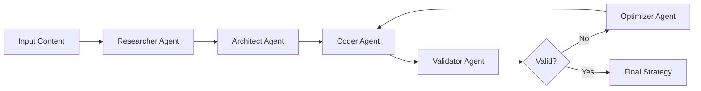

# Lumibot Strategy Generator

Generate complete, production-ready Lumibot trading strategies from various content sources using a coordinated team of specialized AI agents.

## Usage

```bash
/lumibot-generate
```

You will be prompted for:
1. **Input source**: YouTube URL, PDF file path, or text description
2. **Strategy name**: Name for the generated strategy file
3. **Output directory**: Where to save the strategy (default: `Outputs/Strategies/`)

## How It Works

This command orchestrates 5 specialized agents working in parallel:

### 1. 🔍 Lumibot Researcher
- Extracts trading rules from content (YouTube, PDF, text)
- Researches current Lumibot documentation
- Identifies required technical indicators
- Creates detailed strategy specification

### 2. 🏗️ Lumibot Architect
- Designs class structure and architecture
- Plans lifecycle methods (initialize, on_trading_iteration)
- Designs state management and parameters
- Creates comprehensive architecture document

### 3. 💻 Lumibot Coder
- Implements production-quality Python code
- Uses correct Lumibot API methods
- Handles options trading logic accurately
- Adds comprehensive error handling and logging

### 4. 🔍 Lumibot Validator
- Validates syntax and API compliance
- Checks options trading logic
- Verifies error handling and risk management
- Generates detailed validation report

### 5. ⚡ Lumibot Optimizer
- Fixes critical issues from validation
- Optimizes performance
- Refactors code for clarity
- Hardens for production use

## Examples

### Example 1: YouTube Trading Strategy

```bash
/lumibot-generate
# Input source: youtube
# URL: https://www.youtube.com/watch?v=qoTbzJAQshs
# Strategy name: 0dte_iwm_strategy
# Output: Outputs/Strategies/0dte_iwm_strategy.py
```

**Result**: Complete 0DTE options strategy for IWM with:
- Same-day expiration handling
- OTM put/call selling logic
- Intraday timing rules
- Position sizing for 10+ contracts
- Exit conditions based on premium collected

### Example 2: Text Description

```bash
/lumibot-generate
# Input source: text
# Description: "Buy SPY when RSI(14) crosses below 30, sell when RSI crosses above 70.
#              Use daily timeframe, risk 95% of portfolio per trade,
#              take profit at 10%, stop loss at 5%."
# Strategy name: rsi_mean_reversion
# Output: Outputs/Strategies/rsi_mean_reversion.py
```

**Result**: Complete stock strategy with:
- RSI indicator calculation
- Entry/exit logic
- Risk management (TP/SL)
- Position sizing
- Comprehensive logging

### Example 3: PDF Trading Plan

```bash
/lumibot-generate
# Input source: pdf
# File path: C:/Trading/my_strategy.pdf
# Strategy name: iron_condor_weekly
# Output: Outputs/Strategies/iron_condor_weekly.py
```

## Generated Files

The command creates:

```
Outputs/Strategies/
├── {strategy_name}.py          # Complete Lumibot strategy
├── {strategy_name}_analysis.md # Strategy specification from Researcher
├── {strategy_name}_architecture.md # Architecture design from Architect
└── {strategy_name}_validation.md   # Validation report from Validator
```

## Features

### ✅ Comprehensive Strategy Support

**Asset Classes:**
- ✅ Stocks (SPY, QQQ, AAPL, etc.)
- ✅ ETFs
- ✅ Options (single-leg, spreads, 0DTE)
- ✅ Futures (coming soon)

**Strategy Types:**
- ✅ Mean reversion
- ✅ Trend following
- ✅ Options premium collection
- ✅ 0DTE (zero-day-to-expiration)
- ✅ Multi-leg options (spreads, iron condors)
- ✅ Swing trading
- ✅ Intraday strategies

**Technical Indicators:**
- ✅ RSI, MACD, SMA, EMA
- ✅ Bollinger Bands, ATR
- ✅ Custom pandas_ta indicators
- ✅ Volume indicators
- ✅ Multiple timeframe analysis

### ⚡ Production-Quality Code

**Code Quality:**
- ✅ Proper error handling (try/except)
- ✅ Data validation (None checks, empty DataFrames)
- ✅ Comprehensive logging
- ✅ Docstrings for all methods
- ✅ Type hints where beneficial
- ✅ PEP 8 compliant

**Lumibot Best Practices:**
- ✅ Correct Asset object creation
- ✅ Proper get_chains usage for options
- ✅ Efficient data fetching
- ✅ State management across iterations
- ✅ Risk management (stop loss, take profit)
- ✅ Position sizing logic

### 🎯 Options Trading Excellence

**0DTE Strategies:**
- ✅ Same-day expiration filtering
- ✅ Intraday timing logic
- ✅ Premium collection strategies
- ✅ Strike selection (delta, moneyness)
- ✅ Multi-contract handling

**Options Chains:**
- ✅ Expiration date filtering
- ✅ Strike price selection
- ✅ OTM/ATM/ITM logic
- ✅ Spread construction
- ✅ Greeks calculations (coming soon)

## Workflow



**Typical Execution:**
1. **Research Phase** (30-60s): Extract rules, research Lumibot docs
2. **Architecture Phase** (20-40s): Design structure, plan methods
3. **Coding Phase** (40-60s): Implement complete strategy
4. **Validation Phase** (10-20s): Check quality, compliance
5. **Optimization Phase** (20-40s): Fix issues, optimize performance

**Total Time**: 2-4 minutes for production-ready strategy

## Advanced Options

### Custom Parameters

You can customize the generation by modifying the agent prompts:

```markdown
## Research Focus
- Focus on: [specific aspect]
- Ignore: [what to skip]
- Priority: [entry/exit/risk management]

## Architecture Preferences
- Complexity: [simple/moderate/complex]
- Modularity: [high/medium/low]
- Comments: [verbose/minimal]

## Code Style
- Logging level: [debug/info/minimal]
- Error handling: [strict/balanced/permissive]
- Optimization: [speed/readability/both]
```

### Integration with Existing Code

The generated strategies are standalone but can be integrated:

```python
# Import generated strategy
from Outputs.Strategies.my_strategy import GeneratedStrategy

# Customize parameters
my_params = {
    "symbol": "QQQ",
    "rsi_period": 10,
    "rsi_oversold": 25
}

# Use in your trading system
strategy = GeneratedStrategy(
    broker=my_broker,
    parameters=my_params
)
```

## Troubleshooting

### Issue: "No transcript available"
**Solution**: YouTube video doesn't have captions. Try "text" input mode and manually paste transcript.

### Issue: "Invalid Lumibot method usage"
**Solution**: Run `/lumibot-generate` again - the Optimizer agent will fix API issues automatically.

### Issue: "Strategy too complex"
**Solution**: Break down into multiple simpler strategies or simplify the input description.

## Tips for Best Results

### 📝 Writing Good Text Descriptions

**Good Example:**
```
Buy SPY when:
- RSI(14) crosses below 30
- Price is above 50-day SMA
- Volume > 1.5x average volume

Sell when:
- RSI(14) crosses above 70
- OR Take profit at 10% gain
- OR Stop loss at 5% loss

Position sizing: Use 90% of available cash
Timeframe: Daily (end of day)
```

**Poor Example:**
```
Trade SPY using RSI when it's good, sell when it's not
```

### 🎥 YouTube Video Tips

- Choose videos with clear, specific rules
- Videos with visual examples work best
- Avoid videos that only discuss theory
- Look for "step-by-step" strategy explanations

### 📄 PDF Tips

- PDFs with clear section headers work best
- Include entry/exit rules explicitly
- Mention specific indicators and parameters
- Avoid overly complex multi-page strategies

## Related Commands

- `/backtest` - Backtest a generated strategy
- `/optimize-params` - Optimize strategy parameters
- `/deploy-strategy` - Deploy strategy to live trading

## Support

If you encounter issues:
1. Check `Outputs/Strategies/{strategy_name}_validation.md` for specific problems
2. Review the agent outputs for warnings
3. Re-run `/lumibot-generate` - agents improve on each iteration
4. File an issue with the validation report

---

**Note**: This command generates code based on AI interpretation of strategy descriptions. Always backtest thoroughly and paper trade before using with real money. Generated strategies are for educational purposes.
